# 🍈 OS Jackfruit – Container Runtime System

## 📌 Overview
**OS Jackfruit** is a lightweight container runtime system implemented in **C**, designed to demonstrate core **Operating System concepts** such as process isolation, namespace usage, and kernel–user space interaction.

This project simulates the fundamental working principles of modern container engines by creating isolated execution environments using low-level Linux features. It provides hands-on experience with system-level programming and OS internals.

---

## 🎯 Objectives
- Understand Linux process creation and lifecycle
- Implement process isolation techniques
- Explore kernel–user space communication
- Learn Linux kernel module development
- Analyze CPU, memory, and I/O behavior
- Simulate a container runtime environment

---

## ⚙️ Features
- 🧩 Process isolation using Linux mechanisms  
- 📦 Lightweight container-like execution  
- 🧠 Kernel module for monitoring processes  
- 📊 Resource usage tracking (CPU, memory, I/O)  
- 💻 Command-line interface for runtime control  
- 🧪 Stress testing using custom workload programs  

---

## 🛠️ Technologies Used
- **C Programming Language**
- **Linux System Calls**
- **Linux Kernel Modules (LKM)**
- **GCC Compiler**
- **Makefile**
- **Shell Scripting**

---


## 🚀 Setup & Installation

### 1️⃣ Prerequisites
- Linux OS (Ubuntu recommended)
- GCC Compiler
- Kernel headers installed
- Root privileges

Install dependencies:

```bash
sudo apt update
sudo apt install build-essential linux-headers-$(uname -r)
```
2️⃣ Build the Project
cd boilerplate
make
3️⃣ Load Kernel Module
sudo insmod monitor.ko
lsmod | grep monitor
To remove module:
sudo rmmod monitor
4️⃣ Run the Runtime
./engine
5️⃣ Run Test Workloads
./cpu_hog
./memory_hog
./io_pulse
6️⃣ Clean Build Files
make clean

🧠 Core OS Concepts
	•	Process creation (fork, exec, wait)
	•	Process isolation
	•	Kernel module programming
	•	User-kernel communication (IOCTL)
	•	Resource monitoring
  
🔄 Workflow
	1.	Run engine
	2.	Create isolated processes
	3.	Kernel module monitors activity
	4.	Workloads simulate system stress
	5.	Runtime manages execution

⸻

📊 Learning Outcomes
	•	Understanding OS internals
	•	Kernel-user interaction
	•	System-level programming
	•	Container fundamentals

⸻

⚠️ Notes
	•	Requires Linux (VM recommended)
	•	macOS/Windows cannot run kernel modules
	•	Root access required

⸻

❌ Limitations
	•	Not a full Docker-like system
	•	Limited isolation features
	•	Basic monitoring only

⸻

🔮 Future Enhancements
	•	Add namespace isolation
	•	Implement cgroups
	•	Improve CLI
	•	Add logging system

## 📸 Screenshots

### 🔧 Multicontainer supervision
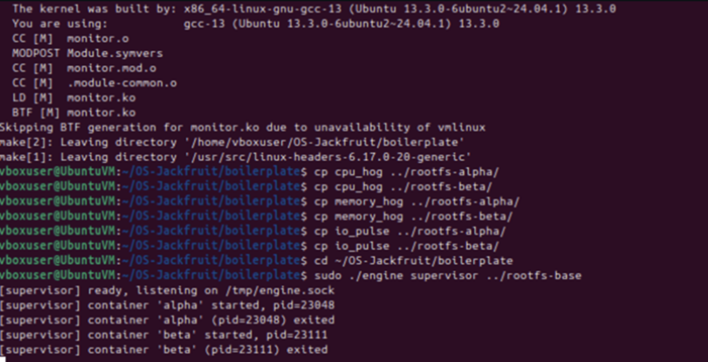
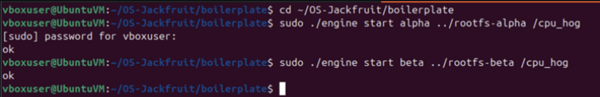

---

### ▶️ Metadata Tracking
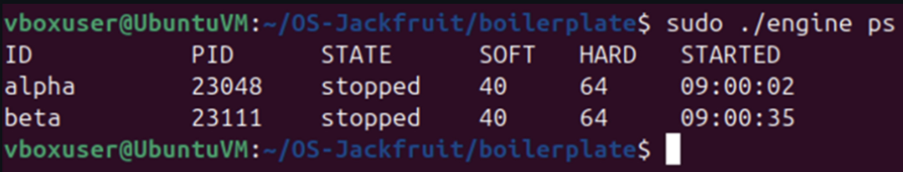

---

### 📋 Bounded Buffer Logging
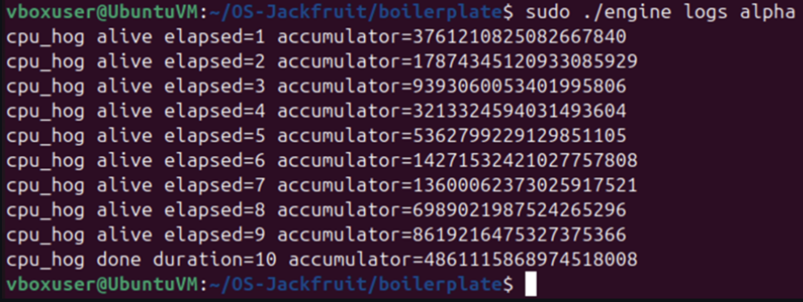

---

### CLI and IPC
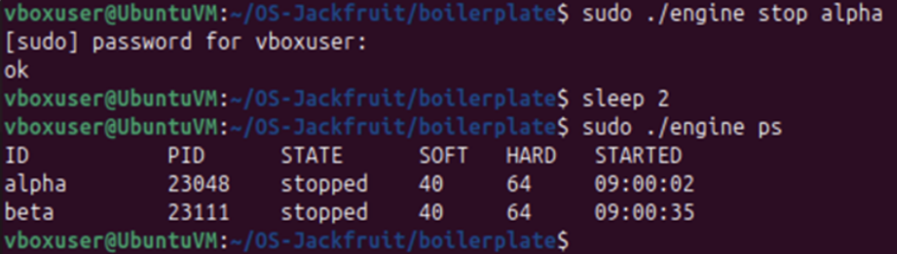
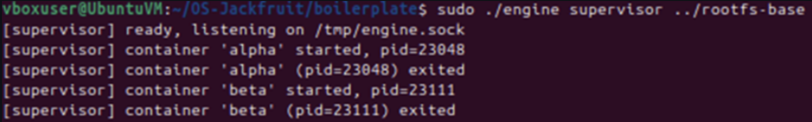

---

### Soft-limit warning
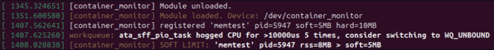

---

### Hard-limit enforcement
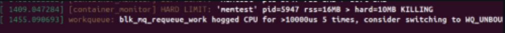
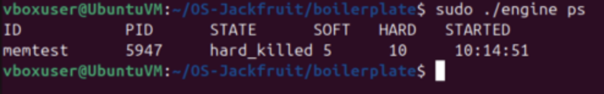

---

### Scheduling Experiment
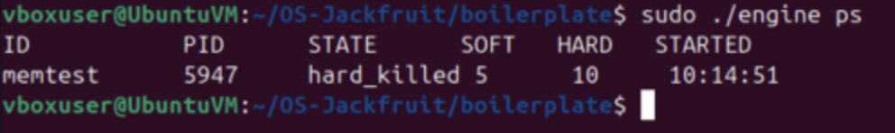


---

### Clean Teardown
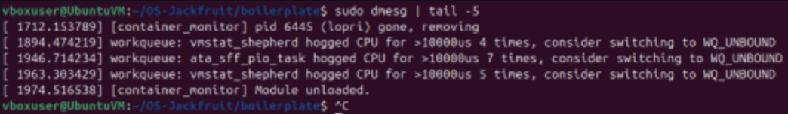

---


👩‍💻 Author

Prarthana Herur

Pooja Koppad


